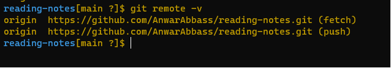

# Seeing Your Remotes

When use remote in `git remote` you can see short names, such as “origin,” of all specified remote handles.like figure below

And there is another remote command can view all the remote URLs next to their corresponding short names. 
like the figure below
